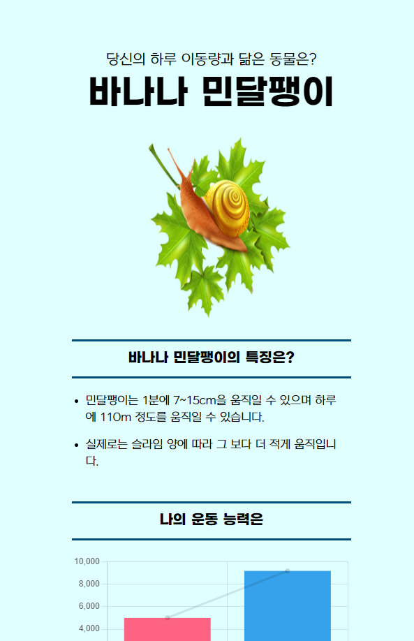
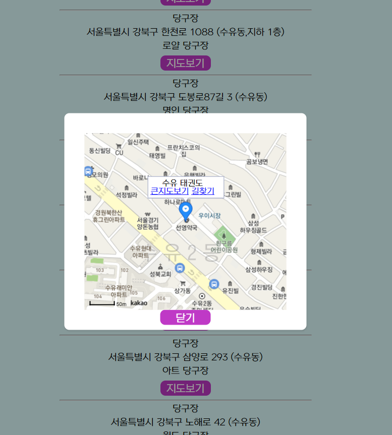
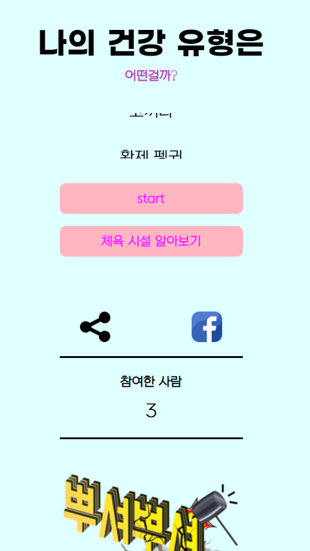
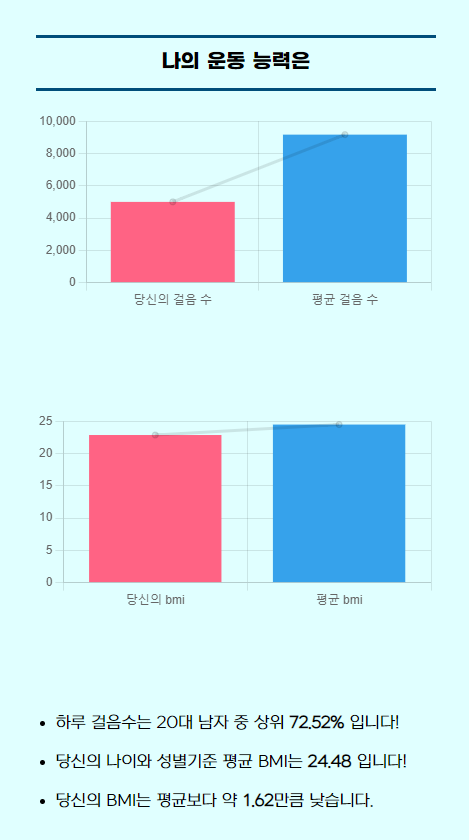
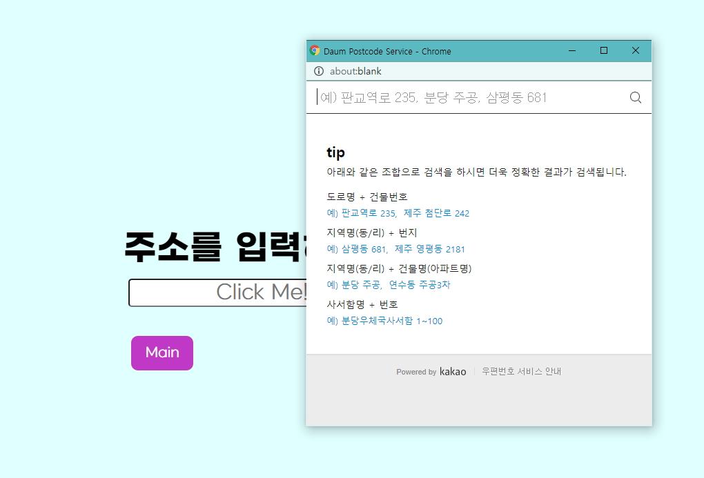
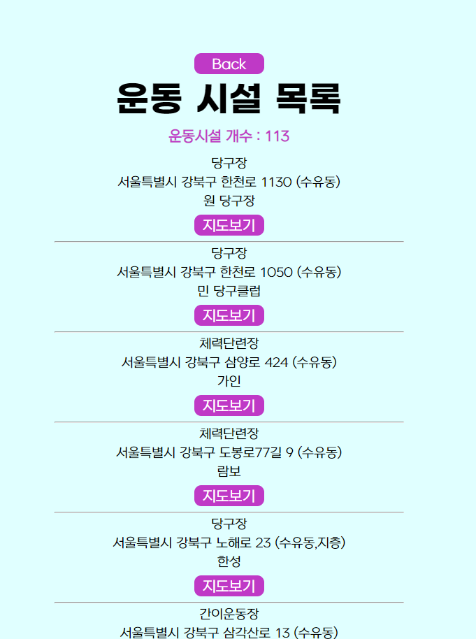
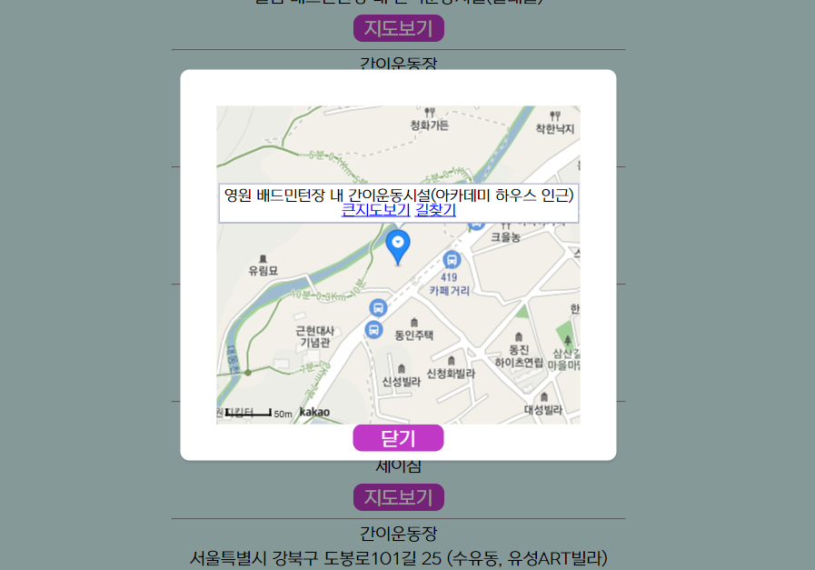

# 나의 건강 유형은?

#### 서비스 대표 이미지

#### 분석 및 개발 도구

  ○ 웹 개발

​    **◦** Python 

​    **◦** Django

​    **◦** Javascript

​    **◦** CSS

​    **◦** HTML

 ○ 데이터 분석

​    **◦** Pandas

​    **◦** Chart.js

 ○ 배포

​    **◦** Heroku

​    **◦** PostgreSQL

## 서비스 개발 개요

**▢** **필요성 및 목적**

  ○ **(운동 독려)** 바쁘게 돌아가는 현대사회 속 현대인의 고질병인 ‘운동 부족’ 현상을 개선하는 데 도움이 되고자 한다. 

  ○ **(흥미와 동기 부여)** **네** 가지 요소를 통해 운동하고자 하는 동기를 부여한다….

1. 최근 추세로 떠오르고 있는 성향 테스트를 과제로 선정

2. 테스트 질문 및 동물 캐릭터 등에 다양한 재미 요소 반영

3. 검사기의 BMI 및 운동 능력에 대해 데이터 분석 및 시각화 

4. 추천 알고리즘을 기반으로 검사자에게 맞춤 운동 추천

  ○ **(인근 문화, 체육시설 이용 촉진)** 체육시설의 정보 및 위치를 알려주는 ‘주변 운동 시설 알아보기’를 통해 공공체육 시설 이용 촉진 및 인근 상권에 도움이 되고자 한다….

활용 데이터셋

| **데이터명**                | **형식** | **사용변수**                                                 | **출처**                       |
| --------------------------- | -------- | ------------------------------------------------------------ | ------------------------------ |
| 체력인증센터걷기정보        | csv      | 측정연령대구분,성별구분,평균걸음수                           | 서울올림픽기념국민체육진흥공간 |
| 전국체육시설현황 데이터     | csv      | 시설명,체육시설유형코드명,시설상태,시설도로명주소1,시설좌표_경도,시설좌표_위도,삭제여부 | 서울올림픽기념국민체육진흥공간 |
| 체력측정 항목별 측정 데이터 | csv      | 측정나이,측정회원성별,측정항목값: BMI                        | 서울올림픽기념국민체육진흥공간 |

## 결과 (이미지)

